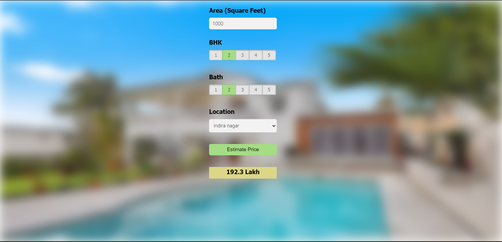

# Bangalore House Price Prediction

## Project Overview

This project aims to predict house prices in Bangalore using various features such as the number of bedrooms, bathrooms, square footage, and location. The prediction model is built using machine learning algorithms, and the application provides a web interface for users to input house details and get price estimates.

